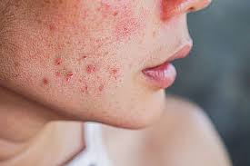

## Irregular Cycles

Women with polycystic ovary syndrome (PCOS) often face challenges such as infrequent or absent menstrual periods due to hormonal imbalances. This condition can disrupt the regularity of the menstrual cycle, leading to complications such as infertility and an increased risk of other health issues. In managing these symptoms, birth control pills can be an effective option. These hormonal contraceptives work by regulating hormone levels, helping to restore a more predictable menstrual cycle and alleviating some of the symptoms associated with PCOS. Additionally, they may help reduce excessive hair growth and acne, common concerns for many women dealing with this syndrome. Regular consultations with a healthcare provider are essential to tailor a treatment plan that addresses individual symptoms and health needs.

### Acne and Skin Problems

Acne and oily skin are prevalent issues faced by many individuals, often resulting from a combination of hormonal changes, genetics, and environmental factors. Treatment options can vary widely, including prescription medications like topical retinoids, ant antibiotics, or hormonal therapies, which target the underlying causes of acne. Additionally, adopting a consistent skincare routine can significantly improve skin health; this may include using gentle cleansers, oil-free moisturizers, and exfoliating products to help unclog pores. It’s important for those affected to consult with a dermatologist to determine the most effective treatment plan tailored to their specific skin type and needs.

*Figure 1: For women diagnosed with polycystic ovarian syndrome (PCOS), a range of physical symptoms can manifest, reflecting the hormonal imbalances often associated with this condition. These may include persistent acne that can affect various areas of the face and body, thinning hair or hair loss from the scalp, and an increase in unwanted facial or body hair, known as hirsutism. Additionally, individuals may notice the emergence of dark patches on the skin, particularly in areas such as the neck, underarms, or inner thighs. The presence of any combination of these symptoms can significantly impact a woman's self-esteem and overall quality of life.*

####  Weight Gain

Obesity is a widespread health concern that affects millions of individuals worldwide, leading to a range of serious medical conditions such as diabetes, heart disease, and joint problems. However, research has shown that even a modest weight loss—typically around 5-10% of one’s body weight—can lead to substantial improvements in overall health. This achievable goal can enhance metabolic function, reduce the risk of obesity-related complications, and improve the effectiveness of various treatments, such as medications for diabetes and hypertension. Incorporating a balanced diet and regular exercise into one’s lifestyle not only facilitates weight reduction but also promotes better physical and mental well-being. Therefore, addressing obesity through manageable lifestyle changes can have a significant impact on health outcomes and quality of life.