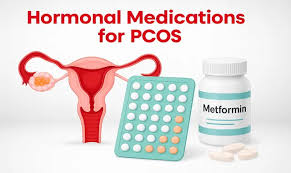

## Medications

In addition to traditional birth control methods, certain medications used in the  
management of diabetes, such as metformin, have been found to be effective in  
addressing insulin resistance. Metformin works by improving the body's sensitivity  
to insulin, which can lead to lower insulin levels and a reduction in circulating  
androgen levels. This is particularly beneficial for individuals experiencing hormonal  
imbalances, as high androgen levels can contribute to various health issues, including  
polycystic ovary syndrome (PCOS). By targeting both insulin resistance and androgen  
production, metformin can play a crucial role in improving overall hormonal balance  
and [[Managing Symptoms]]. 

(2025)

*The medication you need depends on your symptoms and what you require. It's essential to talk  
to a healthcare professional to find the best treatment for you.*

##### Why Are Hormonal Pills Commonly Prescribed for PCOS?

- Irregular ovulation (or no ovulation at all)
- Elevated luteinizing hormone (LH) levels
- Excess testosterone in circulation

### Infertility Treatment

If you are trying to conceive, your doctor may recommend a variety of approaches  
tailored to your specific situation. These could include medication to regulate  
your hormonal levels, improve ovulation, or address underlying health issues  
that may be affecting fertility. In addition to medical treatments, your healthcare  
provider might suggest [[Lifestyle Changes]] such as adopting a balanced diet,  
maintaining a healthy weight, exercising regularly, and reducing stress, all of  
which can positively influence your chances of becoming pregnant. For couples  
facing more significant challenges, in-vitro fertilization (IVF) may be considered  
as a viable option. This advanced reproductive technology involves extracting eggs  
and sperm to create embryos in a laboratory, which are then implanted in the uterus.  
Ultimately, your doctor will work with you to develop a personalized plan that  
considers both your health and your desire to start or expand your family.

> Together, they can explore effective treatment options, which may include therapy,  
> lifestyle modifications, or medication, to help manage these emotional struggles and  
> improve mental health outcomes. Addressing these concerns is crucial for holistic  
> care and can lead to a better understanding of both the physical and emotional  
> aspects of living with PCOS.

#### Professional Guidance

Regular consultations with a healthcare professional are essential for the comprehensive  
diagnosis and treatment of Polycystic Ovary Syndrome (PCOS). These appointments allow  
for a thorough evaluation of symptoms, including irregular menstrual cycles, weight  
fluctuations, and hormonal imbalances. Additionally, healthcare providers can create  
a tailored treatment plan that may include lifestyle modifications, medications, and  
ongoing monitoring to manage both immediate symptoms and [[Long-Term Health Risks]].  
Engaging in open discussions with a specialist helps ensure that patients receive  
personalized support, education, and resources, ultimately improving their overall  
quality of life and well-being.

![[assets/Hormones_and_Polycystic_Ovary_Syndrome_What_You_Need_to_Know.pdf]]
