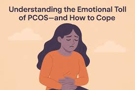

## Emotional Impact

Polycystic Ovary Syndrome (PCOS) is a complex hormonal disorder that can trigger a range of physical and psychological changes in those affected. The physical symptoms, such as irregular menstrual cycles, weight gain, and acne, can contribute to emotional distress. Many individuals with PCOS experience heightened levels of anxiety and depression due to the challenges of managing their symptoms and the societal pressures surrounding body image and fertility. These feelings can be exacerbated by hormonal imbalances that impact mood and energy levels. As a result, self-esteem can take a significant hit, leading to a cycle of negative emotions and further mental health challenges. Understanding these interconnected factors is crucial for providing comprehensive support and care for those living with PCOS.

> Incorporating a balanced diet and regular exercise into one’s lifestyle not only facilitates weight reduction but also promotes better physical and mental well-being. 

*Polycystic ovary syndrome (PCOS) can lead to emotional problems like anxiety and depression. This happens because of physical symptoms such as weight gain, unwanted hair growth, and infertility. These symptoms can lower self-esteem and create a negative body image. Additionally, stress and hormonal changes can increase the risk of mental health issues.*

### Seeking Support

Participating in peer support groups can provide invaluable emotional and practical assistance, as these communities often share lived experiences and coping strategies. Collaborating closely with healthcare teams ensures that you receive comprehensive care tailored to your specific needs. Additionally, maintaining open lines of communication with your doctor is crucial; regular check-ins can help track your progress, address new concerns, and adjust treatment plans as necessary. Together, these approaches can significantly alleviate both the daily challenges and the long-term burden associated with managing your condition.

#### Societal Stigma and Misconceptions

Living with Polycystic Ovary Syndrome (PCOS) often means navigating a complex landscape filled with societal stigma and prevalent misconceptions about the condition. Many people may not fully understand what PCOS entails, leading to stereotypes and unwarranted judgments. This lack of awareness can result in feelings of isolation for those affected, as they may struggle to find support or empathy from friends, family, and even healthcare providers. Additionally, the emotional toll of managing this chronic condition can be compounded by these societal pressures, impacting both personal relationships, mental well-being, and [[Managing Symptoms]]. Individuals may experience anxiety, depression, or frustration as they try to cope with their symptoms in an environment that often lacks understanding and compassion.